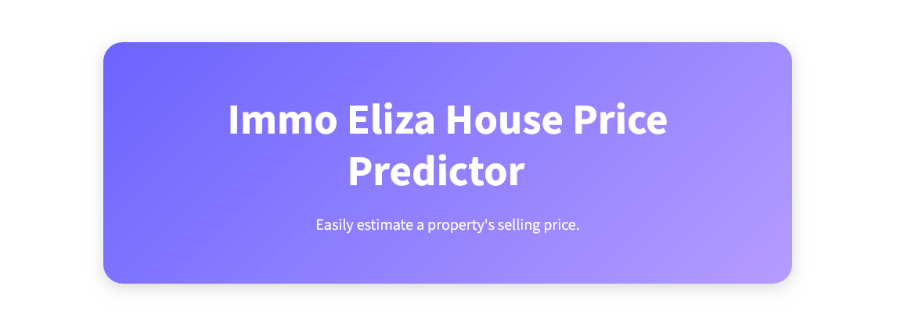

# Description 📊


This subpart focuses on deployment and creations of an API and app. Web developers should be able access the predictions whenever they need to. They also will have access to a small web application for the non-technical employees and possibly their clients to use. 
The goal is to be able to predict prices of a house with desired features using these user-friendly apps. 


---

# Table of Contents

- [Project Overview](#project-overview)  
- [Features](#features)  
- [Dataset](#dataset)  
- [Creating FastAPI and Docker](#creating-fastapi-and-docker)  
- [Creating Streamlit](#creating-streamlit)  
- [Make the work publicly accessible](#make-the-work-publicly-accessible)   
- [Project Structure](#project-structure)   


---

# Project Overview

The project includes:

- deploying a machine learning model through an API endpoint using FastAPI
- deploying said API to Render using docker
- build a small web application using Streamlit

---

# Features

- for every API use case, decide on the input and output
- data need to be in JSON format and return the data in the same format
- Python code needs to handle the conversion from and to JSON 

---

# Dataset

The cleaned dataset contains:

- **15,000+ property listings**  
- **17 features**, including:  
  - Living area  
  - Build year  
  - Number of rooms  
  - Number of facades  
  - Property type  
  - Province & region  
  
---

# Creating FastAPI and Docker

### Key steps

1. **Create the API**  
   - A route at / that accepts:
        GET requests and returns "alive" if the server is up and running
   - A route at /predict that accepts:
        POST requests that receives the data of a property in JSON format and returns a prediction in JSON format

2. **Create a Dockerfile for the API**  
   - Docker packages your application and its dependencies into a single image that can be run on any machine.
   - The Dockerfile is a text file that contains all the commands to build an image and then run it as a container.

3. **Deploy your Docker image on Render.com**  
   - Render allows you to build your Docker container on their server and send requests to it.

---

# Creating Streamlit

- Create a small web application using Streamlit that will allow non-technical people to use your API.
- The Streamlit application will send requests to your API and display the results in a visual interface.

---

# Make the work publicly accessible

-Deploying the application on Streamlit Community Cloud.




---


# Project Structure

```bash
immo-eliza-deployment/
├── api/
│   ├── app.py
│   ├── predict.py
│   ├── schemas.py
│   ├── Dockerfile
│   ├── requirements.txt
│   └── models/       ← model files (e.g. *.joblib, *.pkl)
├── streamlit/
│   ├── streamlit_app.py
│   ├── Dockerfile
│   └── requirements.txt
├── docker/           
├── render.yaml       
├── requirements.txt 
├── test.py           
└── README.md       


---


This project is part of AI & Data Science Bootcamp training at **`</becode>`** and it written by :

- Sandrine Herbelet  [LinkedIn](https://www.linkedin.com/in/) | [Github](https://github.com/Sandrine111222)

